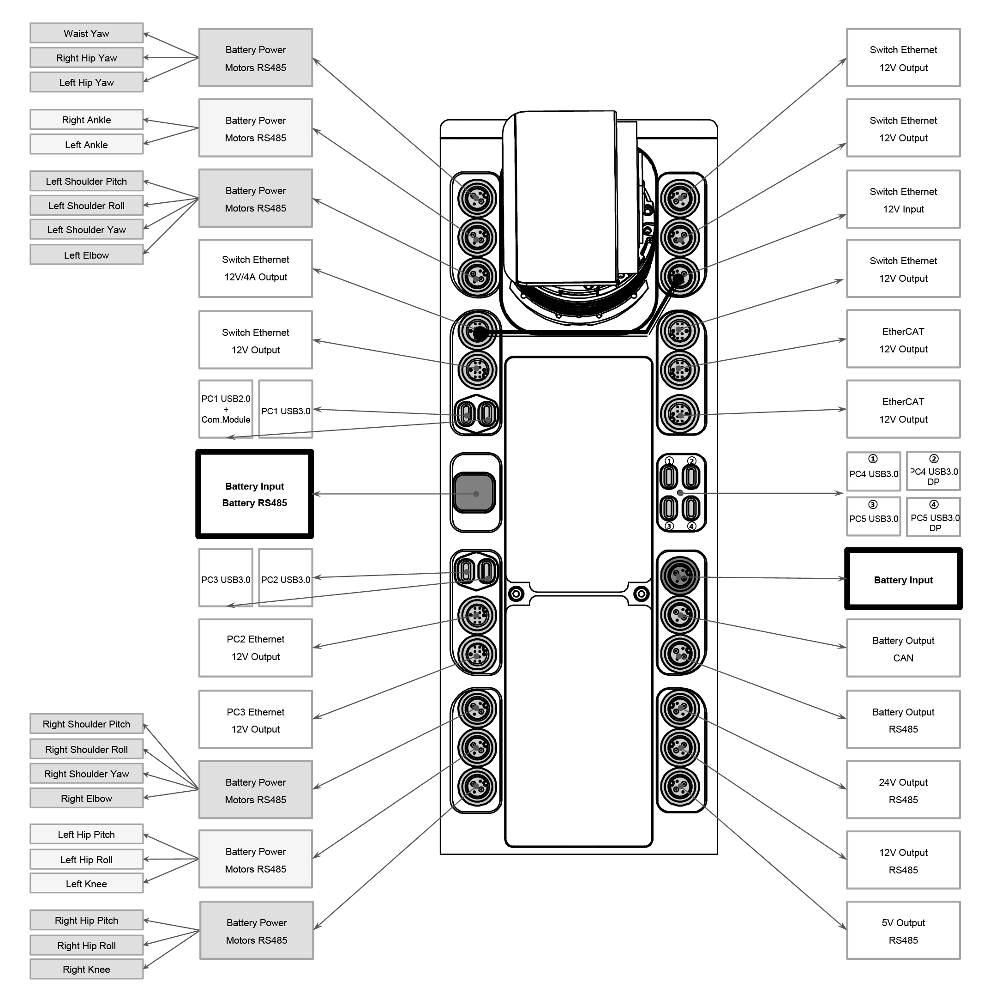

<!-- GETTING STARTED -->
## Overview
This repo contains the code for cufino workspace on unitree h1_2.


## Compilation
If you are using docker, and you already built the docker image following the [README.md](https://github.com/francescocufino/unitree_h1_2/README.md), skip this section (suggested). If you are not using docker, and you want to compile this on you machine, follow this passages

1. Install the dependencies
unitree_sdk2
```bash
git clone https://github.com/unitreerobotics/unitree_sdk2.git
cd unitree_sdk2
mkdir build
cd build
cmake ..
make
sudo make install
```
Eigen, boost, spdlog, kdl
```bash
sudo apt-get install -y libeigen3-dev libboost-all-dev libspdlog-dev liborocos-kdl-dev libkdl-parser-dev
```

2. Clone the repo
```sh
git clone https://github.com/francescocufino/cufino_ws_h1_2.git
```

3. Navigate inside the repo and create build folder and compile
```sh
cd cufino_ws_h1_2
mkdir build
cd build
cmake ..
make
```
## Turning on the robot
Insert the batteries and press the two buttons at the same time, then release them, and immediately after press and hold them.

## Connection to the robot
### Tethered connection
1. Connect to the robot switch ethernet. The 8 pin - ethernet cable has to be connected to the upper right port of the robot, the 12 V switch ethernet shown here .

2. Set your wired connection to be in the robot subnet, setting your static IP address
Settings -> Network -> Wired -> settings icon -> tab IPv4 -> method = manual -> in Address write 192.168.123.222 netmask 255.255.255.0

3. Ping the robot computers to check the connection
```sh
ping 192.168.123.161
ping 192.168.123.162
```

4. If you want to run the applications from your external machine, you are done. If you want to connect to the robot high level computer and run the application from there (ACTUALLY BLOCKED), connect with ssh
```sh
ssh unitree@192.168.123.162
```
Password Unitree0408.

### Untethered connection (ACTUALLY BLOCKED)
1. Ensure that the robot PC2 is turned on and the wi fi adapter is connected. Then, it automatically should connect to the H1_unitree network. Connect your machine to the same network
SSID: H1_unitree
pwd: Unitree0408


2. Connect with ssh. The IP address of H1 PC2 is 192.168.2.10, assigned statically by the router.
If it is not for some reason, you can easily obtain it through
```sh
sudo nmap -T4 -sP 192.168.2.0/24 | grep -B 2 "E4:FA:C4:4C:B2:F8"
```
Then connect
```sh
ssh unitree@192.168.2.10
```
Password Unitree0408.

## Robot set up
1. Wait about one minute after the robot has been turned on.
2. Turn on the robot remote controller, pressing and releasing the button, then immediately after press and hold it
3. Enter in damping mode, pressing L1+A
4. Enter in ready mode, pressing L1+UP

## Wheelchair push demo
To run the demo, please go in src/h1_2_demo and refer to that readme

## Subfolders
From now, please refer to the respective subfolders
- [h1_2_motion](https://github.com/francescocufino/cufino_ws_h1_2/tree/main/src/h1_2_motion) contains the implementation of basic motions (arm, hands, locomotion) exploiting high level functionalitis of unitree_sdk2;
- [h1_2_demo](https://github.com/francescocufino/cufino_ws_h1_2/tree/main/src/h1_2_demo) contains an example user program based on h1_2_motion to perform whole body motion;
- [h1_2_pushing](https://github.com/francescocufino/cufino_ws_h1_2/tree/main/src/h1_2_pushing) contains the code under development for the wheelchair pushing project;
- [h1_2_description](https://github.com/francescocufino/cufino_ws_h1_2/tree/main/src/h1_2_description) contains a universal humanoid robot description (URDF & MJCF) for the [Unitree H1_2](https://www.unitree.com/h1), developed by [Unitree Robotics](https://www.unitree.com/).

   
   
   
   
   
   
   
   
   
   
   
   
   
   

